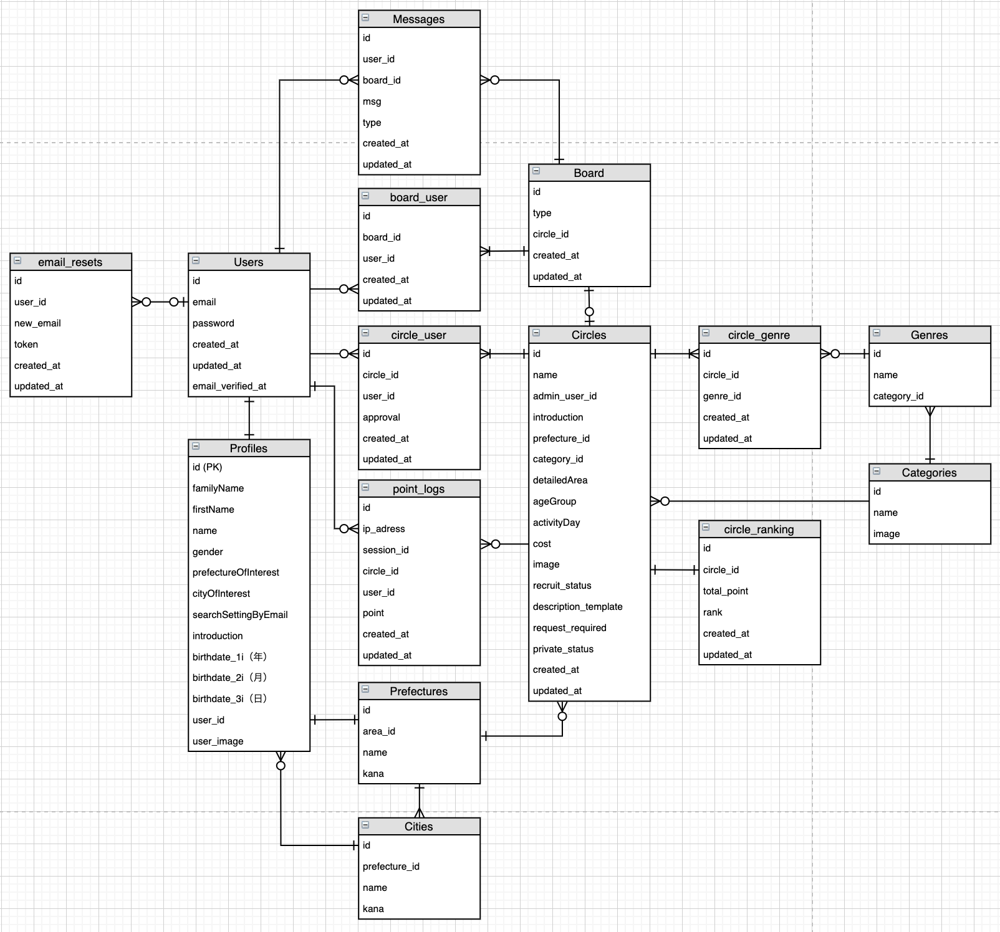

# CIRCLE APP
====

# 概要
"CIRCLE APP"は自由にサークルを作って同じ趣味の人と繋がるイベントポータルサイトです。

# 制作背景
社会人になると会社の同僚以外で新たな友人を作りづらく、学生時代の友人は予定が合わず会えないことが多い。共通の趣味や休みの合う人たちと繋がれるアプリが欲しいと思い作成しました。

# 仕様・使い方
### ① 誰でも簡単にサークルを作れます
ログイン後、サークル作成へ進む から作成できます。
ジャンルを３つまで選択し、必須項目（写真、名前、紹介文、主な活動地域）を埋めたら「作成する」で作成完了。 
 

### ② サークルを探す
地域、カテゴリー、ジャンル、キーワードでの検索が可能です。
サークルは人気順・新着順で並び替えが可能。 
 

### ③ メンバー申請する
申請後、サークル管理者に参加メッセージが送信されます。
承認されるとサークルのグループチャットに参加できます。 
 

### ④ サークルのグループチャットで打ち合わせる
チャット内で話し合う。
サークルの仲間とメッセージを送り合って打ち合わせをしよう。 
 

### ⑤ レスポンシブデザイン対応
スマートフォン、タブレットでも気軽にご利用いただけます。

# 本番環境のURL
<a href="https://suketto.herokuapp.com">CIRCLE APPを開く</a>

# 機能一覧
- ユーザー機能
    - 新規登録、ログイン、ログアウト機能
    - メールアドレス認証機能
    - プロフィール作成、編集機能
    - プロフィール画像はS3に保管
- サークル機能
    - サークル作成、編集、削除機能
    - メンバー申請、承認機能
    - サークル画像はS3に保管
    - ソート機能(地域、カテゴリー、ジャンル、キーワード検索)
    - ランキング機能(毎日0時に自動集計、自動更新)
- チャット機能
    - 参加したサークル内でグループチャットができます。
    - 参加申請後、サークル管理者と個人チャットができます。

# 言語・環境
- PHP 7.4.3
- Laravel Framework 6.18.3
- MySQL  Ver 8.0.19
- JavaScript
- Jquery
- AWS(S3)

# データベース設計
 

## usersテーブル
ユーザー管理テーブル
|Column|Type|Options|
|------|----|-------|
|email|string|null: false, unique: true|
|password|string|null: false|
### アソシエーション
- has_one :profile , dependent: :destroy
- has_many :emailresets
- belongs_to_many :circle
- has_one :circle
- has_many :message
- belongs_to_many :board
- has_many :point_log

## profileテーブル
各ユーザーのプロフィール情報テーブル
|Column|Type|Options|
|------|----|-------|
|familyName|string|null: false|
|firstName|string|null: false|
|name|string|null: false|
|introduction|string|null: false|
|gender|int|null: false|
|prefectureOfInterest|int|null: false, foreign_key: true|
|cityOfInterest|int|null: false, foreign_key: true|
|searchSettingByEmail|int|null: false|
|birthdate_1i|int|null: false|
|birthdate_2i|intg|null: false|
|birthdate_3i|int|null: false|
|user_id|int|null: false, foreign_key: true|
|user_image|string||

### アソシエーション
- belongs_to :user
- blongs_to :prefecture
- belongs_to :city

## circleテーブル
サークル管理テーブル
|Column|Type|Options|
|------|----|-------|
|name|string|null: false|
|admin_user_id|int|null: false, foreign_key: true|
|introduction|string|null: false|
|prefecture_id|int|null: false, foreign_key: true|
|category_id|int|null: false, foreign_key: true|
|detailedArea|string||
|ageGroup|int|null: false|
|activityDay|string||
|cost|string||
|image|string|null: false|
|requruit_status|int|null: false|
|descriptionTemplate|string||
|request_required|int|null: false|
|private_status|int|null: false|

### アソシエーション
- belongs_to :user
- blongs_to_many :user
- belongs_to_many :genre
- blongs_to :prefecture
- has_one :point_log
- has_one :circle_ranking
- belongs_to_many :genre
- belongs_to :category
- has_one :board

## boardテーブル
チャットボード管理テーブル
|Column|Type|Options|
|------|----|-------|
|type|string|null: false|
|circle_id|int|foreign_key: true|

### アソシエーション
- belongs_to_many :user
- has_many :message
- belongs_to :circle

## messageテーブル
メッセージ管理テーブル
|Column|Type|Options|
|------|----|-------|
|user_id|int|null: false, foreign_key: true|
|board_id|int|null: false, foreign_key: true|
|msg|string|null: false|
|type|string|null: false|

### アソシエーション
- belongs_to :user
- belongs_to :board

## prefectureテーブル
都道府県管理テーブル
|Column|Type|Options|
|------|----|-------|
|area_id|int|null: false, foreign_key: true|
|name|string|null: false|
|kana|string|null: false|

### アソシエーション
- belongs_to :area
- has_many :profile
- has_many :circle
- has_many :city

## cityテーブル
市町村管理テーブル
|Column|Type|Options|
|------|----|-------|
|prefecture_id|int|null: false, foreign_key: true|
|name|string|null: false|
|kana|string|null: false|

### アソシエーション
- belongs_to :prefecture
- has_many :profile

## categoryテーブル
カテゴリー管理テーブル
|Column|Type|Options|
|------|----|-------|
|prefecture_id|int|null: false, foreign_key: true|
|name|string|null: false|
|image|string||

### アソシエーション
- has_many :circle
- has_many :genre

## genreテーブル
ジャンル管理テーブル
|Column|Type|Options|
|------|----|-------|
|name|string|null: false|
|category_id|int|null: false, foreign_key: true|

### アソシエーション
- belongs_to :category
- belongs_to_many :circle

## point_logテーブル
サークルのポイント履歴テーブル
|Column|Type|Options|
|------|----|-------|
|ip_adress|int|null: false|
|session_id|string|null: false|
|circle_id|int|null: false, foreign_key: true|
|user_id|int|foreign_key: true|
|point|int|null: false|

### アソシエーション
- belongs_to :user
- belongs_to :circle

## circle_rankingテーブル
サークルのランキングテーブル
|Column|Type|Options|
|------|----|-------|
|circle_id|int|null: false, foreign_key: true|
|total_point|int|null: false|
|rank|int|null: false|

### アソシエーション
- belongs_to :circle

## email_resetテーブル
|Column|Type|Options|
|------|----|-------|
|user_id|int|null: false, foreign_key: true|
|new_emailt|string|null: false|
|token|string|null: false|

### アソシエーション
- belongs_to :user

# その他

